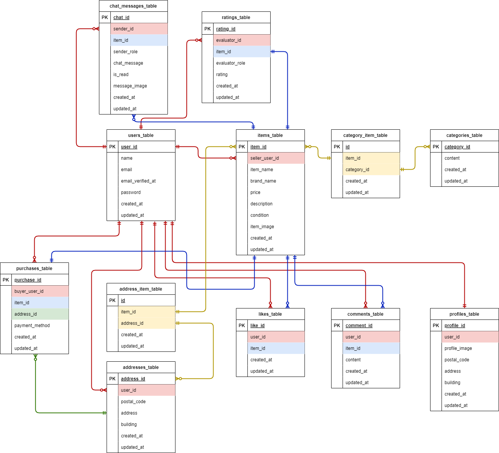

# coachtech-fleamarket（coachtech フリマアプリ）

## 環境構築

**Docker ビルド**

1. コマンドラインにて  
   `git clone git@github.com:risamatsumoto1104/pro-test.git`
2. `cd pro-test`
3. `code .`
4. DockerDesktop アプリを立ち上げる
5. VScode 内にて  
   `docker-compose up -d --build`

**Laravel 環境構築**

1. PHP コンテナ内にログイン  
   `docker-compose exec php bash`
2. パッケージをインストールします。

```bash
composer install
```

3. 「.env.example」ファイルをコピーして「.env」ファイルを作成します。  
   `cp src/.env.example src/.env`

4. .env に以下の環境変数を変更。  
   strip 決済を使用しているため、.env ファイルに STRIPE_KEY=(公開可能キー)と STRIPE_SECRET=（シークレットキー）を追加してください。

```text
DB_CONNECTION=mysql
DB_HOST=mysql
DB_PORT=3306
DB_DATABASE=laravel_db
DB_USERNAME=laravel_user
DB_PASSWORD=laravel_pass

MAIL_MAILER=smtp
MAIL_HOST=mailhog
MAIL_PORT=1025
MAIL_USERNAME=null
MAIL_PASSWORD=null
MAIL_ENCRYPTION=null
MAIL_FROM_ADDRESS=test@example.com
MAIL_FROM_NAME="${APP_NAME}"

# Stripe keys（追加）
STRIPE_KEY=pk_test_..................
STRIPE_SECRET=sk_test_.................
```

5. 本番環境と、テスト環境の APP_KEY=にを削除。  
   新たなアプリケーションキーを作成します。  
   キャッシュの削除も行ってください。

```bash
php artisan key:generate
php artisan key:generate --env=testing
php artisan config:clear
```

6. マイグレーションファイルと、ダミーデータの作成を行います。  
   初年度でのユーザー数 1000 人達成を目標としていますが、今回は 10 名（ユーザー）で作成します。

```bash
php artisan migrate --seed
```

7. storege 内のファイルを使用するため、シンボリックリンクを作成します。

```bash
php artisan storage:link
```

## テストアカウント

```text
name : user1
email : user1@example.com
password : password1
```

```text
name : user2
email : user2@example.com
password : password2
```

```text
name : user3
email : user3@example.com
password : password3
```

- 登録処理：http://localhost/register
- ログイン：http://localhost/login

---

## ER 図



## 使用技術(実行環境)

- DockerCompose 4.0
- Laravel 8.x
- nginx 1.21.1
- PHP 7.4.9
- MySQL 8.0.26
- phpmyadmin
- mailhog
- selenium

## メールを用いたテスト（MailHog を使用）

1. ユーザーの「新規登録」または、「ログイン」を行います。
2. 以下を実行しようとすると、メール認証コードを送信します。

   - 「マイページ」を押下
   - 「出品」を押下
   - 商品詳細より「購入手続きへ」を押下
   - 「★ いいねアイコン」を押下
   - 「コメントを送信する」を押下

3. メール認証コード送信完了ページに遷移したことを確認して、MailHog にてメールを確認して下さい。
4. 「メール認証」ボタンを押下して、ブラウザにアクサスされる。  
   又は、phpMyAdmin にて登録したユーザーの email_verified_at に日付が記載されていれば成功です。

---

1. 購入商品について、評価を行います。
2. 評価を行うと、出品者に通知メールを送信します。
3. 商品一覧画面に遷移したことを確認して、MailHog にてメールを確認して下さい。

## stripe 決済テスト

ダミーデータの item_id は以下の通りです。
item_id | item_name
--- | ---
1 | 腕時計
2 | HDD
3 | 玉ねぎ 3 束
4 | 革靴
5 | ノート PC
6 | マイク
7 | ショルダーバッグ
8 | タンブラー
9 | コーヒーミル
10 | メイクセット

**カード支払いを選択して「購入ボタン」を押下した場合のテスト**

- カード入力画面が表示されます。以下の項目を入力してください

```text
メールアドレス：任意のアドレス
カード情報（番号）：4242 4242 4242 4242
カード情報（日付）：任意の将来の日付
カード情報（セキュリティコード）：任意の3桁の数字
カード保有者の名前：任意の氏名
```

- 支払を押した後、http://localhost/purchase/success/{item_id} に接続します。
- stripe 公式ページの「取引」より成功を確認してください。

**コンビニ支払いを選択して「購入ボタン」を押下した場合のテスト**

- 入力画面が表示されます。以下の項目を入力してください

```text
メールアドレス：任意のアドレス
名前：任意の氏名
```

- 支払を押した後、テスト環境でのコンビニ決済画面に接続します。
- 実際の支払はできない為、http://localhost/purchase/success/{item_id} に接続して、購入を完了させて下さい。
- stripe 公式ページの「取引」より成功を確認してください。※取引が成功するまでに 3 分かかります。

## PHPunit を用いたテスト

1. mysql コンテナ内にログイン  
   `docker exec -it コンテナID bash`

2．root ユーザーでログインして、テスト用データベースを作成します。  
 password: root

```bash
mysql -u root -p

CREATE DATABASE demo_test;
SHOW DATABASES;
```

3．php コンテナ内にログイン  
 `docker-compose exec php bash`

4．テスト用のマイグレーションファイルを作成をします。

```bash
php artisan migrate --env=testing
```

5. 以下のテストを行います。テストを実行してください。

- 会員登録機能
- ログイン機能
- ログアウト機能
- 商品一覧取得
- マイリスト一覧取得
- 商品検索機能
- 商品詳細情報取得
- いいね機能
- コメント送信機能
- 商品購入機能
- 配送先変更機能
- ユーザー情報取得、ユーザー情報変更
- 出品商品情報登録

- 支払方法選択機能　 ⇒ 環境設定ができなかったため、テストが実行されません。

```bash
vendor/bin/phpunit
```

## URL

- 開発環境：http://localhost/
- phpMyAdmin:：http://localhost:8080/
- stripe：https://dashboard.stripe.com/test/dashboard
- MailHog：http://localhost:8025/
